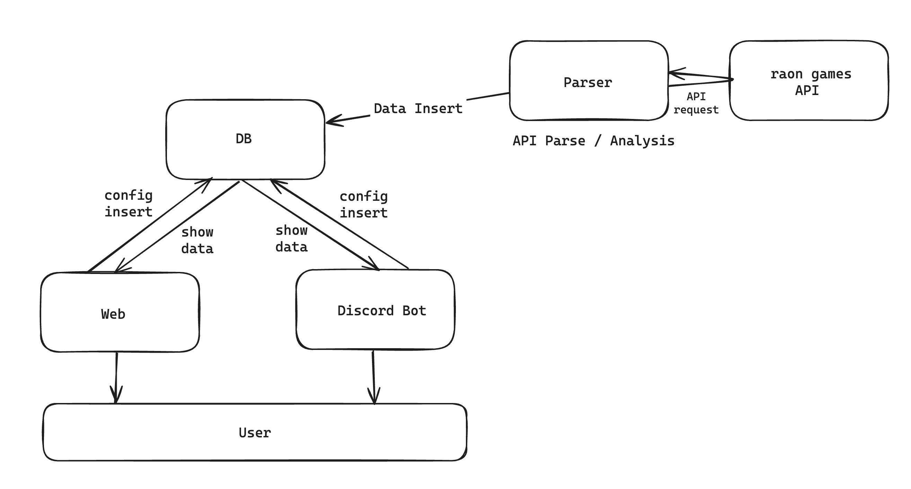

# Grow Castle User Service

이 프로젝트는 Grow Castle 게임의 유저 정보를 모니터링 및 관리하는 서비스입니다. \
raon games에서 제공하는 공식 API를 이용하여 유저 정보를 수집, 이를 바탕으로 유저의 플레이
패턴을 분석해 보여주거나, 게임의 잦은 크래시를 피드백해주는 서비스를 제공합니다.

## 프로젝트 구조

- `parser/` : API Parser 및 분석기
- `web/` : 웹사이트 소스
  - `fe/` : Frontend
  - `be/` : Backend (Java - Spring Boot)
- `bot/` : Discord Bot (Python 3)
  - `prototype/` : 임시 Bot 프로토타입
  - `bot_monitoring_prototype/` : 임시 Bot 프로토타입 2 (민감한 명령어 제거 버전)
- `sql/` : DB 테이블 생성 SQL
- `script/` : health_check / cron / logrotate 스크립트

### 구조도

## 전체 실행

- `/etc/crontab/` 에 아래 스크립트를 등록합니다.
  - `script/cron/cron.sh`
    - 권장 설정 : 매 분마다 실행
  - `script/cron/log_cleaner.sh`
    - 권장 설정 : 매일마다 실행

## TODO

- prototype bot 소스 통합
- 웹사이트 구축
